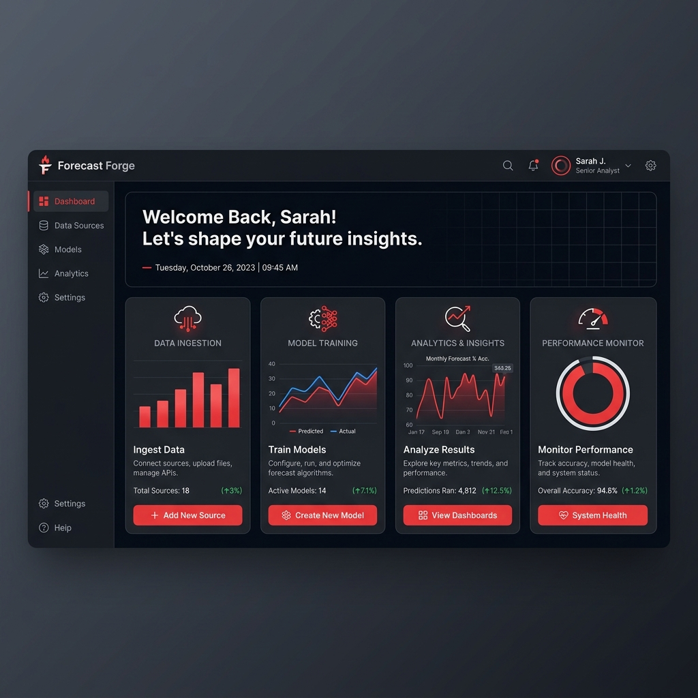
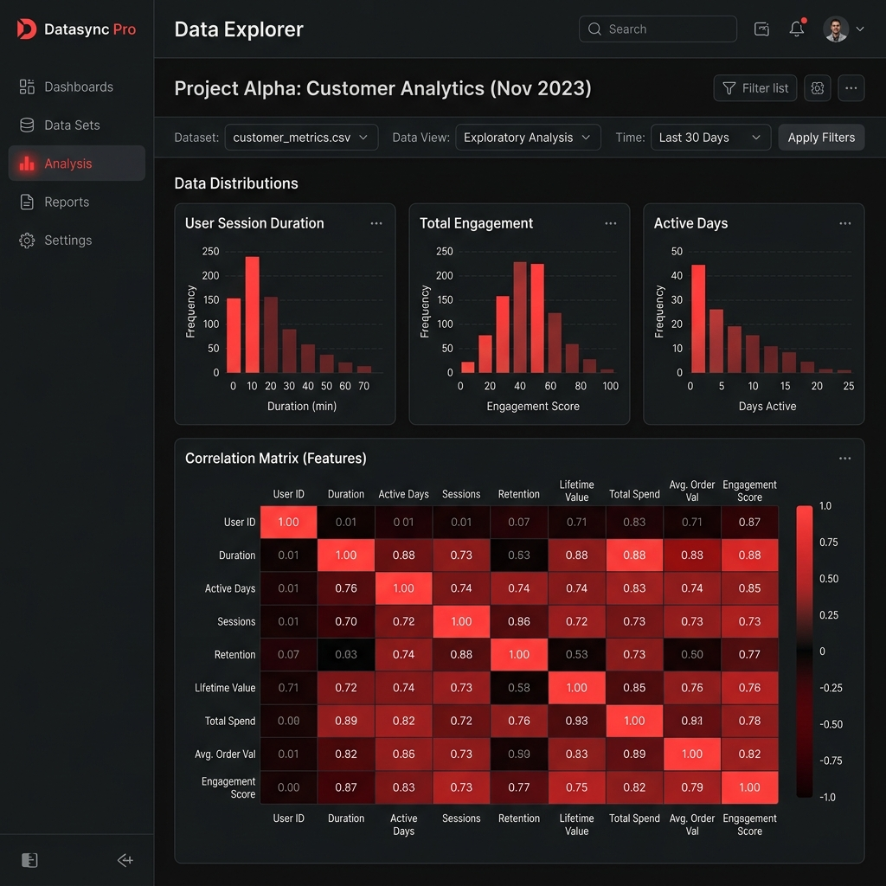
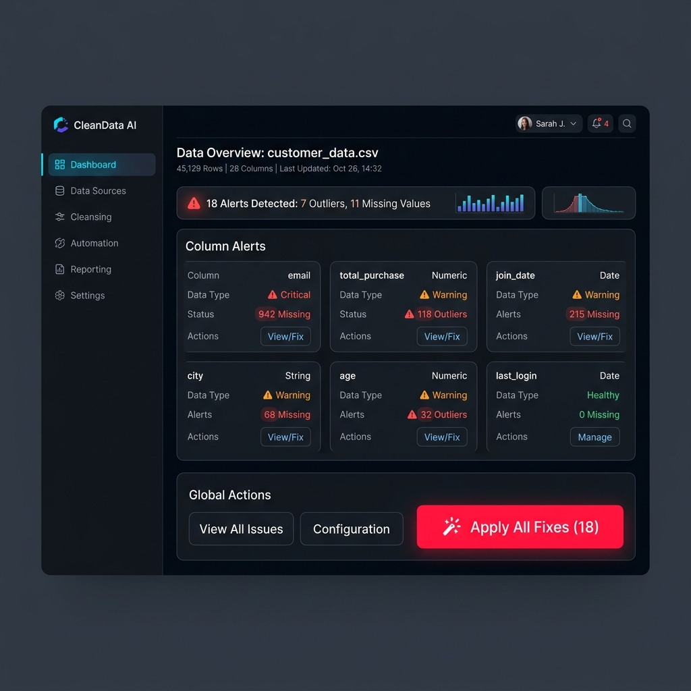
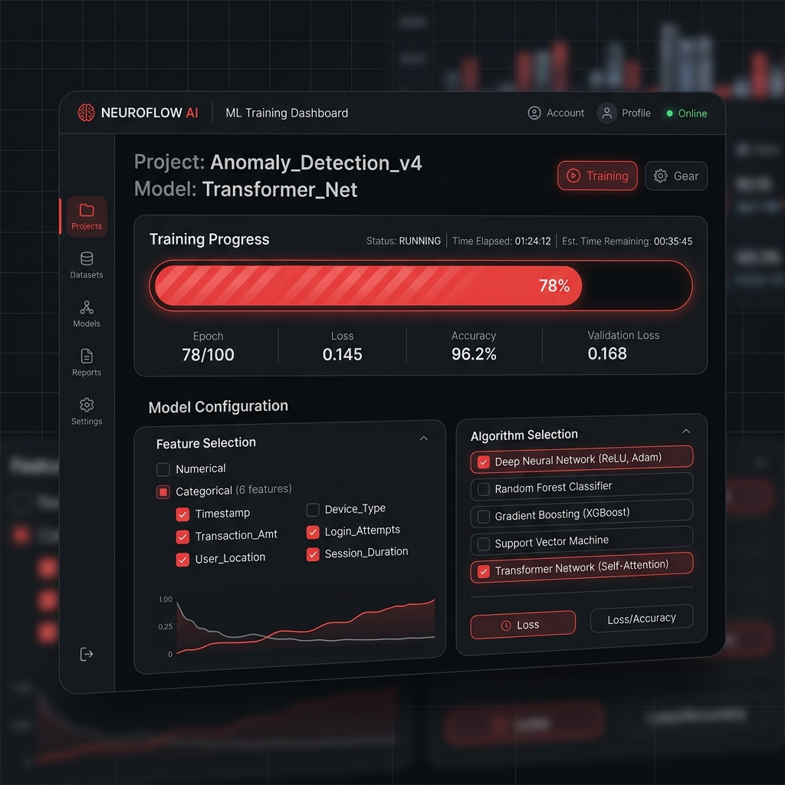
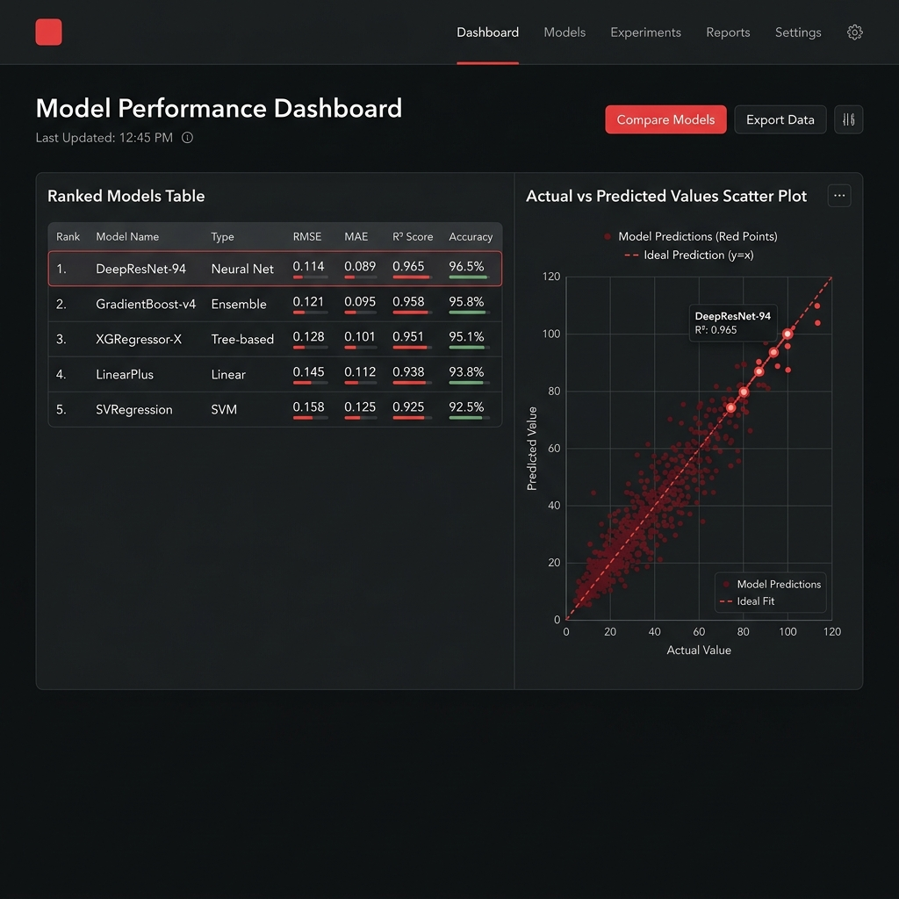
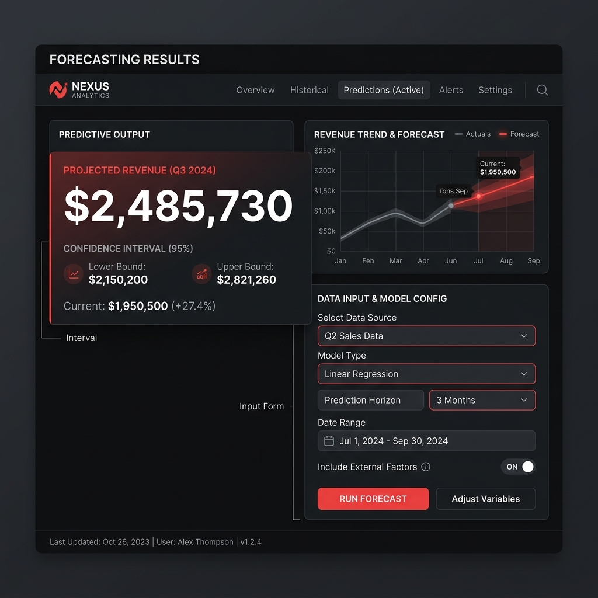
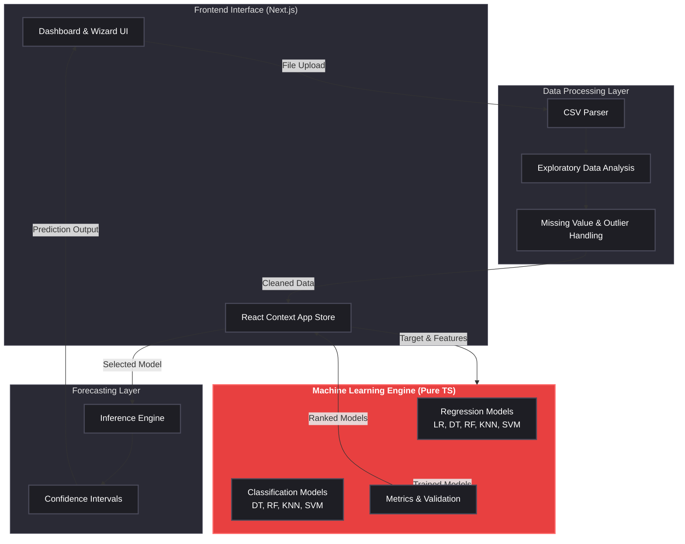

<div align="center">

# 🔥 Forecast Forge


**AI-powered, no-code forecasting platform**  
Go from raw CSV to real ML predictions without writing a single line of code.  
Everything runs securely in your browser.

[](https://nextjs.org/)
[](https://www.typescriptlang.org/)
[](https://tailwindcss.com/)
[](#)
[](LICENSE)

[Features](#-feature-showcase) • [Architecture](#%EF%B8%8F-architecture) • [Workflow](#-application-flow) • [Screenshots](#-screenshots--preview) • [PRD](./docs/01-PRD.md) • [TRD](./docs/03-TRD.md) • [UI/UX](./docs/02-UX-FLOW.md) • [Sprint Plan](./docs/05-SPRINT-PLAN.md)

</div>

---

## 🎮 What Is Forecast Forge?

Forecast Forge democratizes data science. It is a fully client-side application that transforms raw datasets into actionable predictive models. Instead of wrestling with Pandas scripts or Python environments, you get a beautiful, guided UI to explore data, handle outliers, train algorithms, and forecast the future.

> No Python. No external APIs. No server-side processing. 100% of the Machine Learning engine runs locally in your browser.

---

## 📸 Screenshots & Preview

| Dashboard | Upload & Explore |
|:---:|:---:|
|  |  |
| **Welcome screen and metrics overview** | **Data distribution and correlation heatmaps** |

| Data Cleaning | Model Training |
|:---:|:---:|
|  |  |
| **One-click outlier and missing value fixes** | **Live training of 5 ML algorithms** |

| Model Comparison | Forecasting Results |
|:---:|:---:|
|  |  |
| **Side-by-side performance and feature importance** | **Predictions with 95% confidence intervals** |

---

## 🏗️ Architecture

Forecast Forge separates the interface from the heavy mathematical lifting, maintaining high performance while operating entirely on the client side.



---

## 🔄 Application Flow

The entire experience is built around a linear, foolproof 6-step workflow designed for non-technical users.


---

## ✨ Feature Showcase

### 📤 Upload CSV & Auto-Detect
Drag and drop datasets up to 20MB. The engine automatically parses headers, detects data types, and intelligently suggests prediction targets based on data distributions.

---

### 📊 Data Exploration & Heatmaps
Visualize your data before training. View per-column distributions, value counts, missing percentages, and a beautiful correlation matrix heatmap to spot feature dependencies.

---

### 🧹 One-Click Data Cleaning
Say goodbye to manual Pandas scripts. Automatically detect outliers via Z-scores and handle missing values using mean, median, mode, or drop strategies—all with a single click.

---

### 🧠 Pure TypeScript ML Engine
Train 5 real machine learning algorithms directly in your browser without any backend:
- Linear Regression (Gauss-Jordan OLS)
- Decision Trees (CART with MSE/Gini)
- Random Forests (30-tree bagged ensemble)
- K-Nearest Neighbors (Euclidean inverse-distance)
- Support Vector Machines (Pegasos-style SGD)

---

### 🏆 Model Comparison & Analytics
Compare model performance side-by-side. Track R², RMSE, Accuracy, and F1 Scores. Dive deeper with actual vs. predicted scatter plots, residual error distributions, and feature importance rankings.

---

### 🎯 Forecasting & Confidence Intervals
Select the winning model and input new data to generate instant predictions. View outputs complete with 95% confidence intervals and historical prediction logging.

---

## 🛠️ Tech Stack

**Frontend Framework**  
Built on **Next.js 15** (App Router, Turbopack) using **React 19** and strictly typed **TypeScript 5**. State management handles the workflow natively using React Context and `useReducer`.

**Design & UI**  
A premium dark-first interface styled with **Tailwind CSS 3.4**, utilizing **shadcn/ui** primitives, **Lucide React** icons, and rich visualizations powered by **Recharts 2.15**.

**Machine Learning Engine**  
A 100% custom, zero-dependency engine written in TypeScript. All algorithms, matrix operations, and metrics calculations run directly in the V8 browser engine.

---

## 📚 Documentation Hub

To explore the product specs, architecture, and design decisions behind Forecast Forge, refer to the detailed documentation:

- 📑 [Product Requirements Document (PRD)](./docs/01-PRD.md)
- 🎨 [UI/UX & Application Flow](./docs/02-UX-FLOW.md)
- 🏗️ [Technical Requirements Document (TRD)](./docs/03-TRD.md)
- 🤖 [Agent Orchestration Prompt](./docs/04-AGENT-PROMPT.md)
- 📅 [Sprint Plan & Roadmap](./docs/05-SPRINT-PLAN.md)
- 💅 [Design System (DESIGN.md)](../DESIGN.md)

---

## 🚀 Getting Started

### Prerequisites
- **Node.js** 18.x or later
- **npm** 9.x or later

### Installation & Local Run

```bash
# Clone the repository
git clone https://github.com/dARSHANdR4/Forecast-Forge.git
cd Forecast-Forge

# Install dependencies
npm install

# Start the development server
npm run dev
```

The application will be running at **http://localhost:9002** (or your default Next.js port). A sample dataset `test-iris.csv` is included in the `/public` folder for immediate testing.

### Deployment

Forecast Forge is completely static/client-side and highly optimized for Vercel.

```bash
npm i -g vercel
vercel
```

---

## 🤝 Author & License

**Darshan DR** — [@dARSHANdR4](https://github.com/dARSHANdR4)

This project is licensed under the MIT License.

<div align="center">
  <br />
  <i>Built with ❤️ and TypeScript. No Math.random() was harmed in the making of these predictions.</i>
</div>
