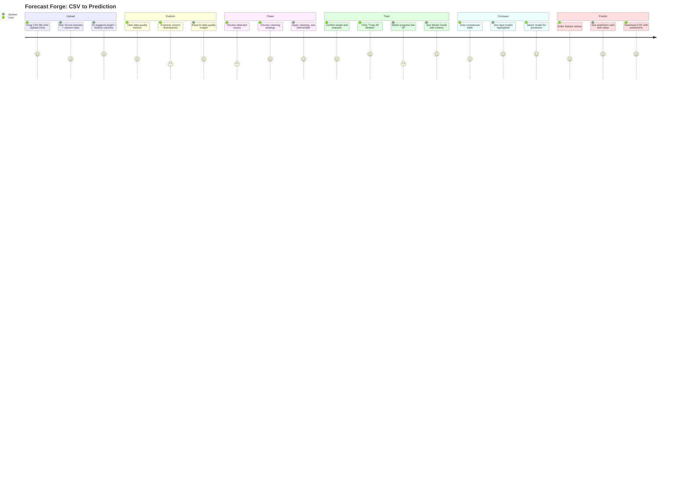

# Forecast Forge — UX Flow & Information Architecture
## Phase 2–3: Screen Definitions & User Journeys

---

## 1. Information Architecture

```
Forecast Forge
├── Dashboard (/)
│   ├── Recent Datasets grid
│   ├── Quick Actions (Upload New, Continue Last)
│   └── System Status
├── Upload (/upload)
│   ├── Upload Zone (drag-drop + browse)
│   ├── File Validation Status
│   ├── Data Preview Table (10 rows)
│   └── AI Column Suggestions
├── Explore (/explore)
│   ├── Data Quality Metrics (row/col/missing/duplicate %)
│   ├── Column Statistics Table
│   ├── Distribution Charts (histograms)
│   ├── Correlation Heatmap
│   └── AI Insight Card
├── Clean (/clean)
│   ├── Data Quality Report
│   ├── Missing Value Actions
│   ├── Outlier Detection Panel
│   ├── Encoding Options
│   └── Before/After Preview
├── Train (/train)
│   ├── Target Column Selector
│   ├── Feature Column Selector
│   ├── Model Type Selector / AutoML
│   ├── Training Progress
│   └── Model Result Cards
├── Compare (/compare)
│   ├── Model Comparison Table
│   ├── Metric Charts
│   ├── Feature Importance Comparison
│   └── Select Best Model Action
├── Predict (/predict)
│   ├── Single Prediction Form
│   ├── Prediction Card (result)
│   └── Batch Prediction (upload → download)
└── Results (/results)
    ├── Forecast Visualization Panel
    ├── Feature Importance Card
    ├── AI Insight Card
    ├── Summary Metrics Row
    └── Export Actions
```

---

## 2. Primary User Journey — Upload to Prediction



---

## 3. Screen Definitions

### Screen 1: Dashboard (`/`)
**Purpose**: Landing page — show recent work and quick actions.

| Component | Type | Backend Dependency |
|---|---|---|
| Welcome Section | Static text + metric cards | None |
| Recent Datasets | Dataset Card grid | Session store |
| Quick Actions | Button group (Upload New, Continue Last) | Session store |
| System Status | Metric cards (models trained, predictions made) | Session store |

**States:**
- **Empty**: First visit — show empty state with "Upload your first dataset" CTA
- **Active**: Has session data — show recent datasets and quick actions
- **Loading**: Skeleton loaders for dataset cards

---

### Screen 2: Upload (`/upload`)
**Purpose**: File upload with validation and AI-assisted column inference.

| Component | Type | Backend Dependency |
|---|---|---|
| Wizard Stepper | Step indicator (step 1 of 6 active) | None |
| Upload Zone | Drag-drop + browse button | None |
| File Info | Metric cards (filename, size, rows, cols) | CSV parser |
| Data Preview | Data Table (10 rows) | CSV parser |
| AI Suggestions | AI Insight Card with suggested columns | Genkit AI flow |
| Continue Button | Primary button → /explore | Session store |

**States:**
- **Empty**: No file selected — upload zone centered, all other sections hidden
- **Loading**: File is being parsed — skeleton loader for preview table
- **Success**: File parsed + AI suggestions ready — full preview shown
- **Error**: Invalid file — error toast + error state in upload zone

---

### Screen 3: Explore (`/explore`)
**Purpose**: Automated data exploration and quality assessment.

| Component | Type | Backend Dependency |
|---|---|---|
| Wizard Stepper | Step 2 active | None |
| Quality Metrics | 4 Metric Cards (rows, cols, missing %, duplicate %) | data-analysis.ts |
| Column Table | Data Table with stats per column | data-analysis.ts |
| Distribution Tab | Histogram charts per numeric column | data-analysis.ts + Recharts |
| Correlation Tab | Heatmap matrix | data-analysis.ts + Recharts |
| AI Insight | AI Insight Card | Genkit AI flow |
| Continue Button | → /clean | None |

**States:**
- **Empty**: No dataset uploaded — redirect to /upload
- **Loading**: Computing statistics — skeleton loaders for all sections
- **Success**: All stats computed — full display
- **Error**: Analysis failed — error state with retry

---

### Screen 4: Clean (`/clean`)
**Purpose**: Detect and fix data quality issues.

| Component | Type | Backend Dependency |
|---|---|---|
| Wizard Stepper | Step 3 active | None |
| Quality Report | Card listing issues found | data-cleaning.ts |
| Missing Values Panel | Per-column strategy selectors | data-cleaning.ts |
| Outlier Panel | Threshold slider + detection | data-cleaning.ts |
| Encoding Panel | Column-level encoding options | data-cleaning.ts |
| Before/After Preview | Side-by-side Data Tables | data-cleaning.ts |
| Apply Button | Primary button → transforms data | data-cleaning.ts |
| Skip Button | Ghost button → /train (no cleaning) | None |

**States:**
- **No Issues**: Data is clean — show success state with "Proceed" CTA
- **Issues Found**: Display categorized issues with action controls
- **Applying**: Progress bar during cleaning transformation
- **Error**: Cleaning failed — error state with retry

---

### Screen 5: Train (`/train`)
**Purpose**: Configure and train ML models.

| Component | Type | Backend Dependency |
|---|---|---|
| Wizard Stepper | Step 4 active | None |
| Target Selector | Dropdown (pre-filled from AI) | Session store |
| Feature Selector | Checkbox list in scroll area | Session store |
| Model Selector | Grouped select or "AutoML" toggle | None |
| Train Button | Primary CTA | ml-service.ts |
| Progress | Progress bar with step text | ml-service.ts |
| Results | Model Card(s) | ml-service.ts |

**States:**
- **Configuration**: Selecting columns and model — training section hidden
- **Training**: Progress bar active, buttons disabled
- **Complete**: Model Card(s) displayed with metrics
- **Error**: Training failed — error state with model name and error message

---

### Screen 6: Compare (`/compare`)
**Purpose**: Side-by-side model comparison and selection.

| Component | Type | Backend Dependency |
|---|---|---|
| Wizard Stepper | Step 5 active | None |
| Comparison Table | Model Comparison Panel per DESIGN.md §10.24 | Session store |
| Metric Chart | Bar chart comparing MAE/RMSE/R² | Recharts |
| Feature Importance | Stacked feature importance per model | Session store |
| Select Button | Per-row CTA → selects model | Session store |

**States:**
- **Single Model**: Only 1 trained — show Model Card + "Train more models" CTA
- **Multiple Models**: Full comparison view
- **No Models**: Redirect to /train

---

### Screen 7: Predict (`/predict`)
**Purpose**: Generate predictions with selected model.

| Component | Type | Backend Dependency |
|---|---|---|
| Wizard Stepper | Step 6 active | None |
| Single Prediction | Form inputs for each feature | ml-service.ts |
| Prediction Card | Large value + confidence range | ml-service.ts |
| Batch Upload | Upload Zone for new CSV | CSV parser |
| Batch Download | Download button for predictions CSV | csv-utils.ts |

**States:**
- **No Model**: No model selected — redirect to /compare
- **Ready**: Input form displayed
- **Predicting**: Loading spinner on predict button
- **Result**: Prediction Card displayed
- **Batch Result**: Download button active

---

### Screen 8: Results (`/results`)
**Purpose**: Comprehensive forecast dashboard — the hero screen.

| Component | Type | Backend Dependency |
|---|---|---|
| Forecast Chart | Line chart: actual vs predicted | Recharts |
| Confidence Bands | 95% and 80% fill areas | Recharts |
| Summary Metrics | Inline stat chips (RMSE, MAE, R²) | Session store |
| Feature Importance | Horizontal bar card | Session store |
| AI Insight | AI-generated interpretation | Genkit AI flow |
| Export | Download CSV button | csv-utils.ts |

---

## 4. Component States Matrix

Every data-dependent component must implement all four states:

| State | Visual Treatment | Trigger |
|---|---|---|
| **Empty** | Empty State component (§10.19): icon + title + description + CTA | No data available |
| **Loading** | Skeleton Loader (§10.20): shimmer animation matching content shape | Async operation in progress |
| **Success** | Full content rendered | Data available, no errors |
| **Error** | Error State (§10.21): icon + title + message + retry button | Operation failed |

---

## 5. Navigation & Wizard Flow Rules

1. **Linear progression**: Users move Upload → Explore → Clean → Train → Compare → Predict
2. **Backward allowed**: Sidebar allows jumping to any completed step
3. **Skip forward blocked**: Cannot visit /train without completing /upload first
4. **Step persistence**: Completed steps remain accessible (data preserved in session)
5. **New upload resets**: Uploading a new file resets all downstream steps
6. **Sidebar always visible**: Except on mobile (<768px) where it becomes a drawer

---

## 6. Accessibility Requirements

| Requirement | WCAG Level | Implementation |
|---|---|---|
| Color contrast ≥ 4.5:1 | AA | All text on dark surfaces verified |
| Keyboard navigable | AA | Tab order, Enter/Space activation |
| Focus visible | AA | 2px accent focus ring (--shadow-focus) |
| Screen reader support | AA | aria-label on all interactive elements |
| No color-only information | AA | Icons + text alongside status colors |
| Focus trap in modals | AA | Modal traps focus when open |
| Escape key closes overlays | AA | Modals, drawers, dropdowns |
| Chart data as table | AA | `<details>` element with accessible table |
